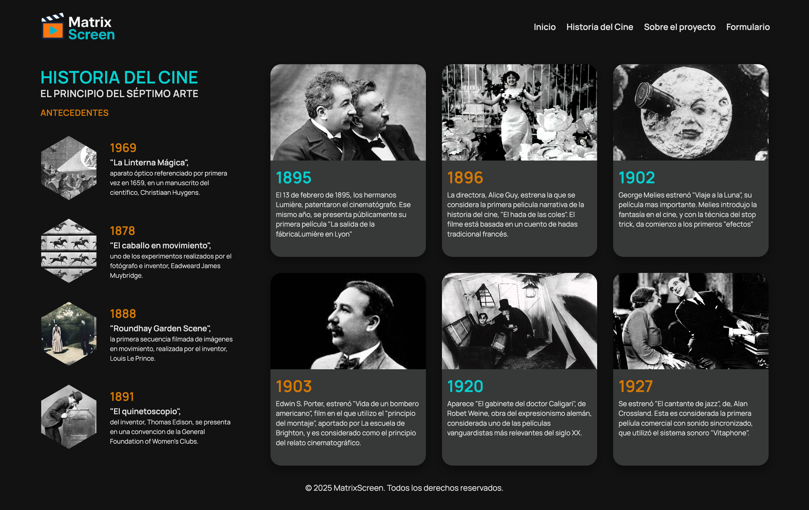
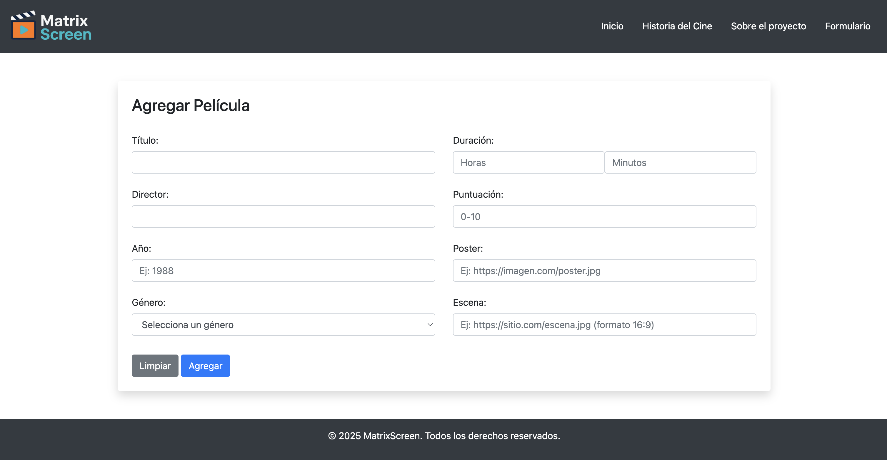

# 🎬 MatrixScreen — Plataforma de películas

**MatrixScreen** es una aplicación web donde los usuarios pueden explorar una selección de películas, leer información sobre cine y enviar sugerencias mediante un formulario interactivo.

Proyecto pensado con enfoque **educativo**, diseño claro y estructura escalable.

---

## 🚀 Demo

📌 Este proyecto está pensado para ejecutarse **localmente**.

Más abajo encontrarás las instrucciones para levantarlo en tu equipo.

---

## 🎯 Objetivo del proyecto

Crear una plataforma simple y atractiva para:

- Mostrar un catálogo visual de películas
- Practicar consumo de API y manejo de DOM
- Aprender estructura de proyectos front + back
- Implementar un formulario funcional

---

## 🧠 Funcionalidades principales

- ✅ Carrusel de imágenes en Home
- ✅ Listado dinámico de películas
- ✅ Página informativa sobre cine
- ✅ Página explicando el proyecto
- ✅ Formulario con validaciones
- ✅ Backend con API para películas
- ✅ Conexión con base de datos MongoDB (local o Atlas)
- ✅ Bundling con Webpack

---

## 🛠️ Tecnologías utilizadas

### **Frontend**

- 🧱 HTML
- 🎨 CSS
- ⚙️ JavaScript
- 📦 Webpack
- 🌱 Dotenv
- 🌐 Axios
- 🎨 Bootstrap

### **Backend**

- 🟩 Node.js
- 🚏 Express.js
- 🍃 MongoDB + Mongoose
- 🔐 Dotenv

---

## 🖼️ Capturas del sitio

| Home                                  | Historia del Cine                           |
| ------------------------------------- | ------------------------------------------- |
|  |  |

| About Us                                | Formulario                            |
| --------------------------------------- | ------------------------------------- |
|  |  |

---

## 📁 Estructura del proyecto

```bash
MatrixScreen/
├── back/                        # Backend (Node + Express + MongoDB)
│   └── src/
│       ├── config/              # Conexión DB, variables
│       ├── controllers/         # Lógica de negocio
│       ├── models/              # Modelos de MongoDB
│       ├── routes/              # Endpoints API
│       └── server.js            # Servidor principal
│
└── front/                       # Frontend (Webpack + JS)
    ├── assets/                  # Imágenes y recursos
    ├── pages/                   # Vistas HTML adicionales
    ├── scripts/                 # Lógica JS
    ├── styles/                  # Estilos CSS
    ├── public/                  # Archivos generados por Webpack
    ├── index.html               # Página principal
    └── webpack.config.js        # Configuración Webpack
```

## 📦 Instalación local

```bash
🔹 Clona el repositorio

git clone https://github.com/JCesarAguilar/MovieApp-MatrixScreen-Fullstack.git
cd MovieApp-MatrixScreen-Fullstack

🔹 Backend (API)

cd back
npm install
npm start

🔹 Frontend (Web)
cd ../front
npm install
npm run build
```
